The build process for the Cepstrum is similar to other hotswap Keebio boards, but there's a few new wrinkles due to things like Choc stabilizers, so pay close attention to everything here.

## Build Compatibility

This build guide is for the Cepstrum Rev. 1, which features pre-soldered components, including Kailh Choc hotswap sockets.

### Build Tutorial Videos by Keebio

Video in progress, subscribe to the [Keebio YouTube channel](https://www.youtube.com/keebio) to find out when it gets released!

## Parts List

First up, time to get your parts:

- [Cepstrum Kit](https://keeb.io/products/cepstrum-choc-low-profile-65-65xt-split-staggered-keyboard) which includes:
  - Cepstrum Rev. 1 PCBs
  - Cepstrum Switch Plates and Bottom Plates
  - 6mm M2 standoffs
  - 4mm M2 screws
  - Choc Stabilizers (partially-assembled)
  - SKUF Feet
- [USB-C to USB-C cable](https://keeb.io/products/usb-c-to-usb-c-cable)
- [Choc Switches](https://keeb.io/products/kailh-choc-low-profile-switches-v1) (V1-only, not compatible with V2 or other low-profile switches)
- [Choc Keycaps](https://keeb.io/collections/low-profile-choc) (Choc-spaced, includes MBK and MCC)
- [3D-Printed Cepstrum Parts](https://github.com/keebio/cepstrum-case) (optional)

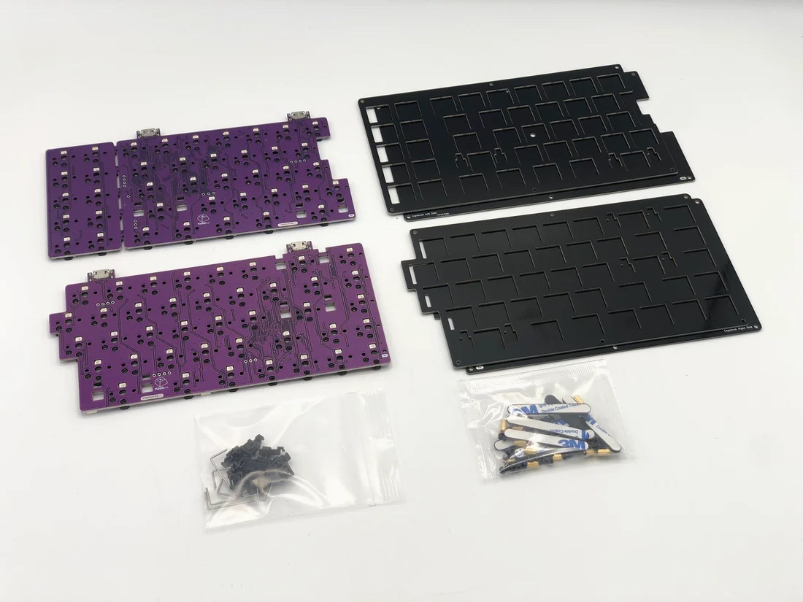

## Build Steps Summary

1. Check PCB
2. Add Stabilizers to Switch Plate
3. Add Switches
4. Assemble Case
5. Add Keycaps
6. Board Notes

## Check Your PCBs

Sometimes during the soldering process of the board, the RGB LEDs can be damaged since they are a bit sensitive to heat. So, you'll want to plug in your PCBs to make sure all of your LEDs are functioning properly before putting your board together.

The easiest way to test is to open up VIA and then go the the Lighting options for the board. Next, change the Effect to `Solid Color` and go through different colors to detect any defective LEDs.

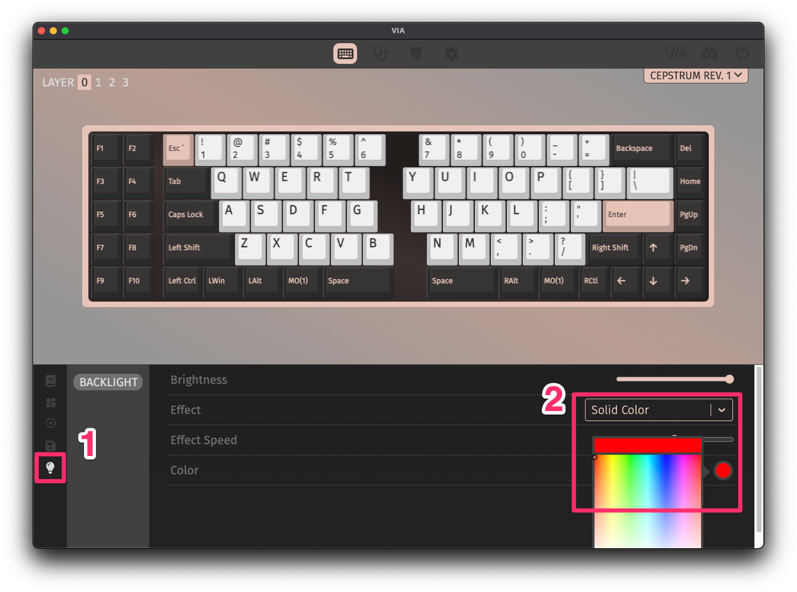

If you see any odd behavior with the LEDs in Solid Color` mode, like in the example below, please email us, and we can arrange for a replacement PCB.

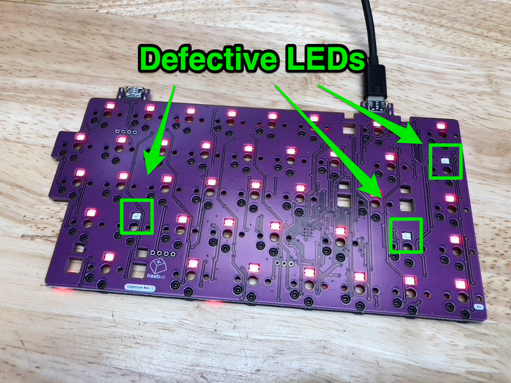

## Add Stabilizers to Switch Plate

The Choc stabilizers used for the build are much different than MX stabilizers you may be used to. The installation process is much different as well. The stabilizers are plate-mounted, but instead of being seated on top of the plate, they attach to the switch plate from underneath.

Detailed information about stabilizer installation is here: [Kailh Choc Stabilizer Installation](choc-stabs)

The two plastic pieces have already been pre-assembled for you to reduce orientation issues, so you can skip the first two steps in the guide.

Once installed, it should looks like this:

From underneath, it'll look like this:

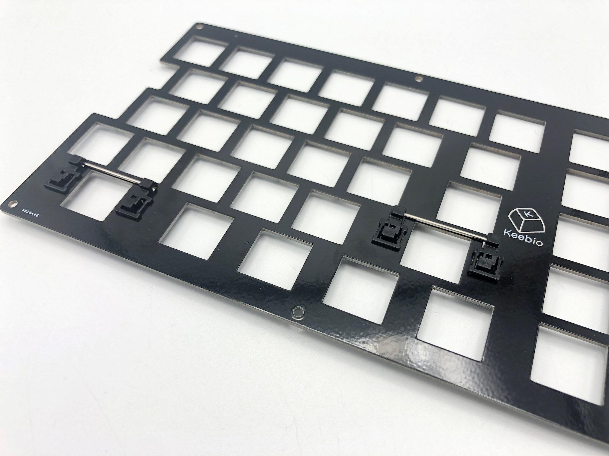

## Add Switches

Next, overlay the switch plate on top of the PCB and add some switches to the corners and middle.

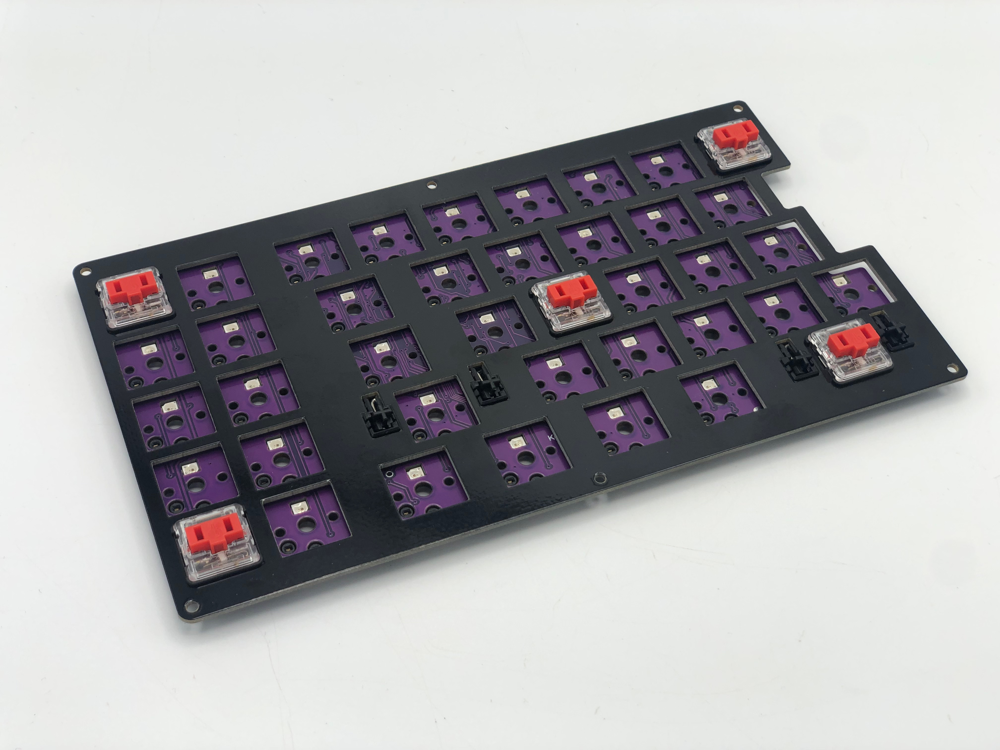

Keep adding switches to each row, while checking to make sure that each switch is level, after completing a row.

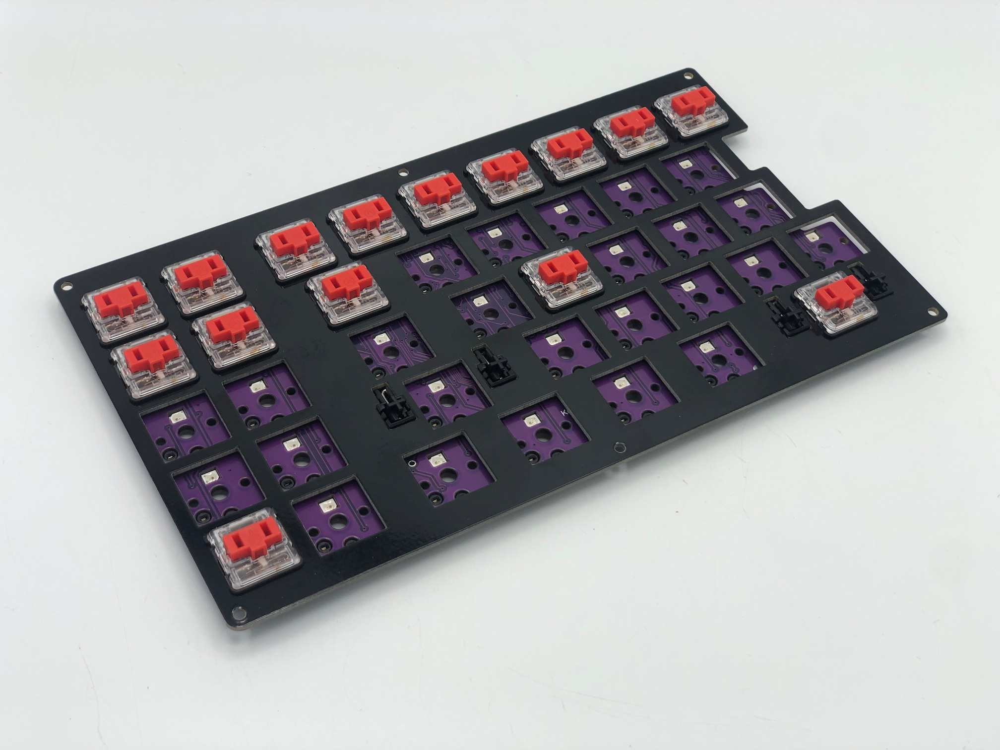

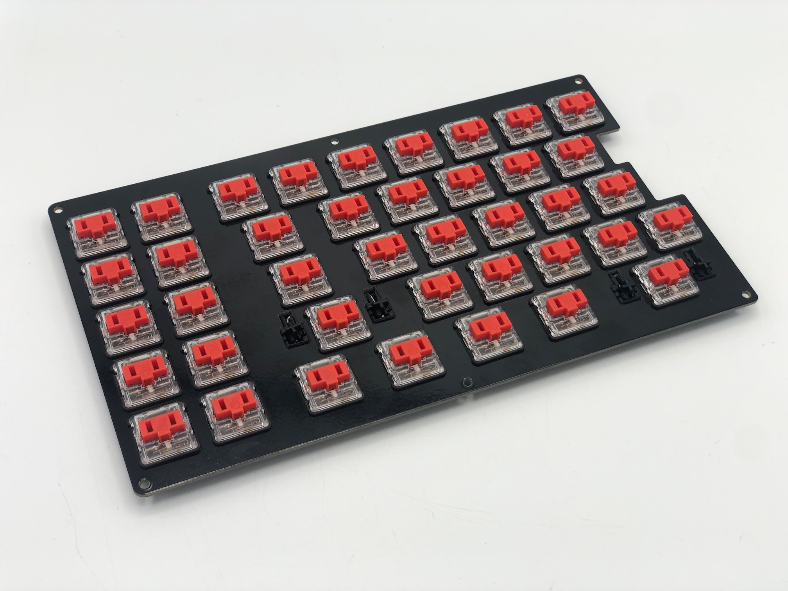

Once you've added the switches, now is a good time to plug in the PCB and [test all of the keys](testing-pcb).

## Assemble Case

First, add SKUF feet to the bottom plate

The [SKUF Alignment Tool](https://keeb.io/products/skuf-alignment-tool-guide) comes in handy here if you have one.

Next, add screws and standoffs to the bottom plate.

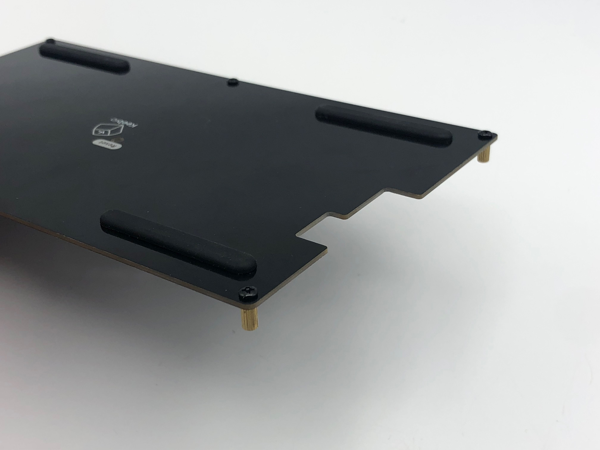

(Optional) If you've got a middle layer, insert it over the standoffs. You might need to run a screwdriver through the holes first to clear out any extra material in there.

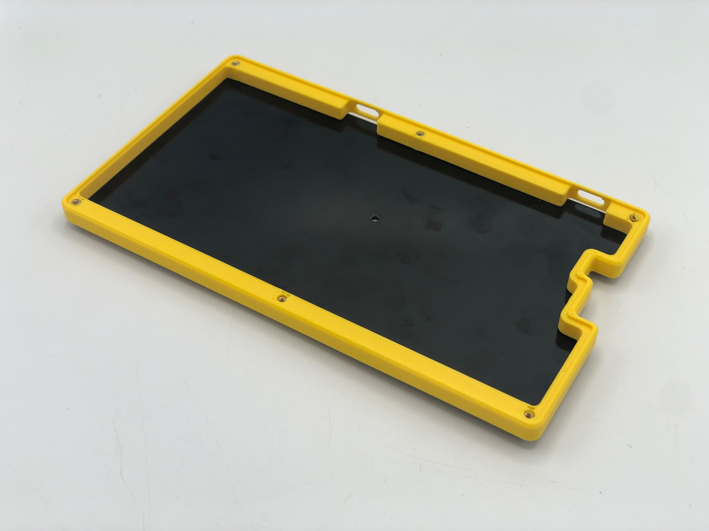

Then, put the switch plate on top and screw it in.

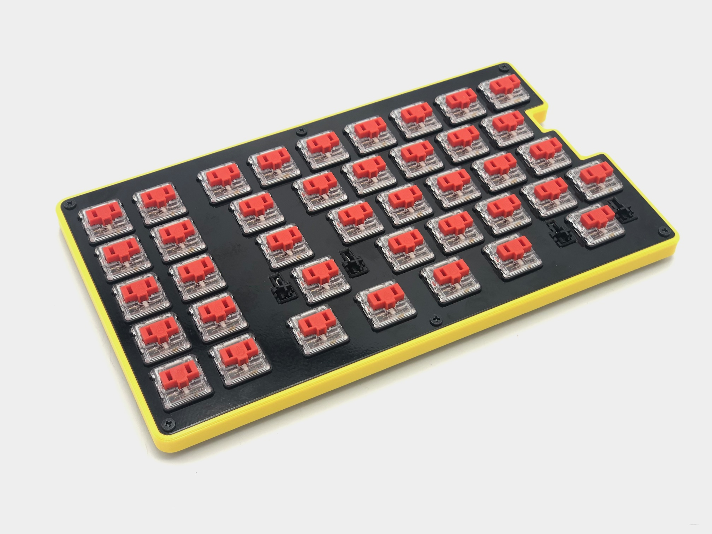

## Add Keycaps

Finally, add your keycaps to your board.

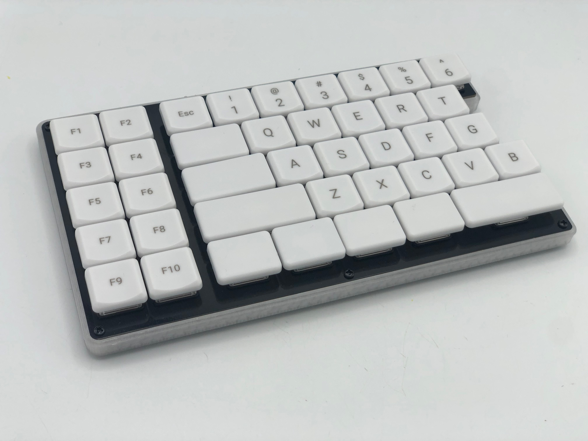

One thing to pay attention to the is the orientation of the stabilized keycaps, as there stabilizer stems on the keycap are not vertically centered. The stems should be slightly above the center of the keycap, and the part that says MB and ergo should face the bottom of the board.

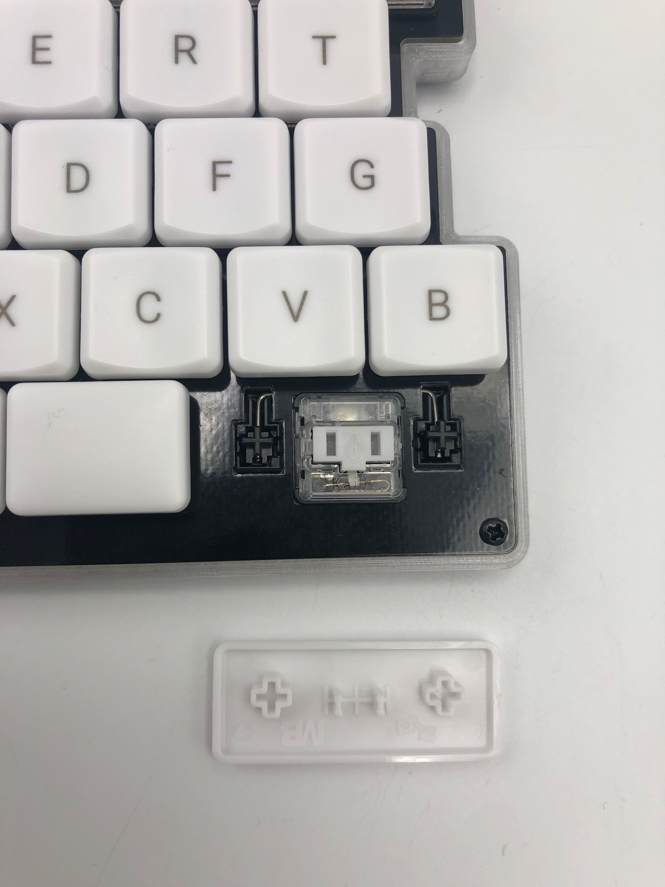

## Board Notes

### Remapping/reprogramming Board

Looking to remap/reprogram your board? Check out our guide for [remapping your keyboard](remapping-keyboard).

While the bottom plates have a hole at the bottom to allow you to access the reset button to allow your Cesptrum to be reflashed, if you don't want to be flipping your board over to press reset, you can also use one of the following options when remapping your Cepstrum:

1. Use [VIA](via.md) to remap your keys. The stock firmware on the Cepstrum PCBs already have VIA support enabled. This allows you to remap the keyboard without having to reflash the board.
2. If you'd like to reflash your Cepstrum, since it has a RP2040 controller on board, follow these instructions: [Flashing RP2040 Board](flashing-firmware#rp2040-board-uf2-bootloader)
